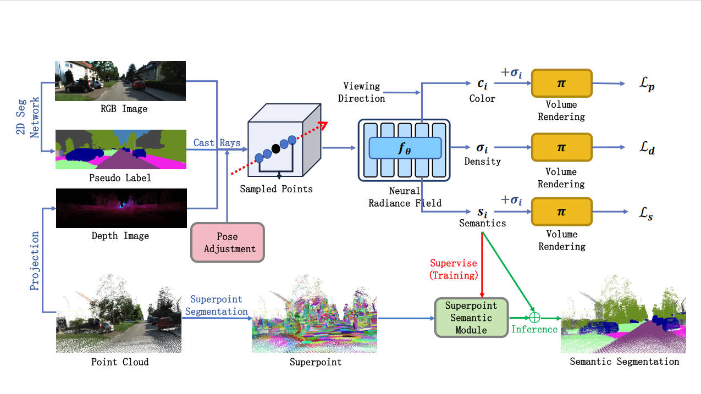

# StreetSeg
Please refer to [https://github.com/WHU-USI3DV/StreetSeg](https://github.com/WHU-USI3DV/StreetSeg)

**Cross-modal Semantic Transfer for Point Cloud Semantic Segmentation**
<br>Zhen Cao, Xiaoxin Mi, Bo Qiu, Zhipeng Cao, Chen Long, Xinrui Yan, Chao Zheng, Zhen Dong, Bisheng Yang<br>



Abstract: *3D street scene semantic segmentation is essential for urban understanding. 
However, supervised point cloud semantic segmentation networks heavily rely on expensive manual annotations and demonstrate limited generalization capabilities across datasets, which poses limitations in a range of downstream tasks. 
In contrast, image segmentation networks exhibit stronger generalization. 
Fortunately, mobile laser scanning systems can collect images and point clouds simultaneously, offering a potential solution for 2D-3D semantic transfer. 
In this paper, we introduce a cross-modal label transfer framework for point cloud semantic segmentation, without the supervision of 3D semantic annotation.
Specifically, the proposed method takes point clouds and the associated posed images of a scene as inputs, and accomplishes the pointwise semantic segmentation for point clouds.
We first get the image semantic pseudo-labels through a pre-trained image semantic segmentation model. 
Building on this, we construct implicit neural radiance fields (NeRF) to achieve multi-view consistent label mapping by jointly constructing color and semantic fields. 
Then, we design a superpoint semantic module to capture the local geometric features on point clouds, which contributes a lot to correcting semantic errors in the implicit field. 
Moreover, we introduce a dynamic object filter and a pose adjustment module to address the spatio-temporal misalignment between point clouds and images, further enhancing the consistency of the transferred semantic labels. 
The proposed approach has shown promising outcomes on two street scene datasets, namely KITTI-360 and WHU-Urban3D, highlighting the effectiveness and reliability of our method.*

## Dataset
Download the two datasets:
- [WHU-Urban 3D](https://whu3d.com), for mls-w data in Wuhan city;
- [KITTI-360](https://www.cvlibs.net/datasets/kitti-360);
  
For pseudo-labels, refer to [SegFormer](https://github.com/NVlabs/SegFormer), [Mask2Former](https://github.com/facebookresearch/Mask2Former) or other image semantic segmentation methods.

For superpoint generation, refer to [Lin et al](https://github.com/yblin/Supervoxel-for-3D-point-clouds).

## Run

To train/test the method on WHU-Urban3D dataset, you can edit the parameter in the file ```wuhan.sh```, and run:

```bash
sh scripts/wuhan.sh
```

For KITTI-360 dataset, you can edit the parameter in the file ```kitti360.sh```, and run:

```bash
sh scripts/kitti360.sh
```

